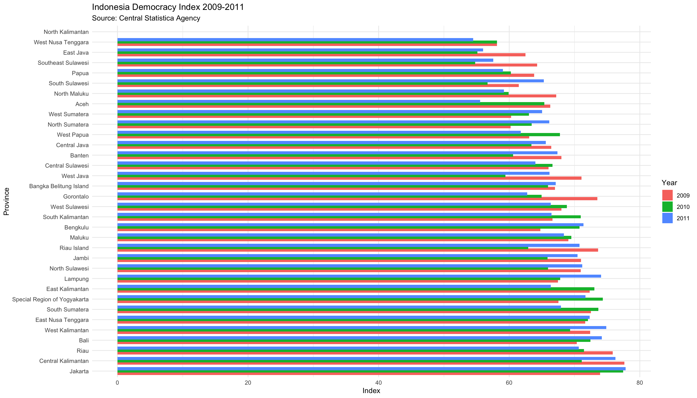
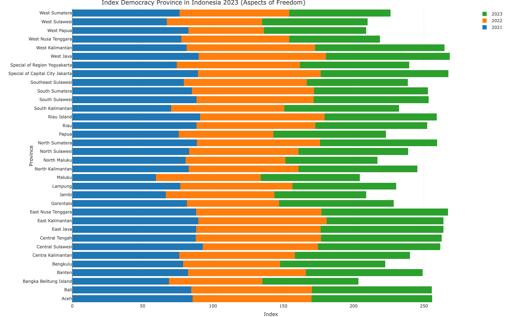

# INDONESIAN DEMOCRACY INDEX 

An R-based guide to exploring, critiquing and visualizing Democracy data in Indonesia, through a collection of publicly available data sources. The democracy data results have been collected from [the Central Bureau of Statistics of Indonesia](https://www.bps.go.id/id/statistics-table?subject=528/)Various functions of the appropriate R packages, I use to statisticize Indonesian democracy from 2009 to 2024.
Hopefully it will be a useful open-source & transparent guide to investigate the past and future state of Indonesian democracy. All work presented here can be reproduced in its entirety.

## [Indonesian Democracy Index (IDI) by Province 2009 - 2011](https://www.bps.go.id/id/statistics-table/2/NTk4IzI=/indeks-demokrasi-indonesia--idi--menurut-provinsi.html)

### Read Data Base
```{r}
library(knitr)

markdown_table <-kable(idi2009-2011, format = "markdown")
cat(markdown_table)
print(markdown_table)

```
|Province                     |  2009|  2010|  2011|
|:----------------------------|-----:|-----:|-----:|
|Aceh                         | 66.29| 65.36| 55.54|
|North Sumatera               | 60.20| 63.45| 66.15|
|West Sumatera                | 60.29| 63.04| 65.02|
|Riau                         | 75.85| 71.45| 70.65|
|Jambi                        | 71.00| 65.88| 70.46|
|South Sumatera               | 72.52| 73.65| 67.92|
|Bengkulu                     | 64.76| 70.78| 71.36|
|Lampung                      | 67.47| 67.80| 74.08|
|Bangka Belitung Island       | 67.01| 65.94| 67.13|
|Riau Island                  | 73.61| 62.89| 70.78|
|Jakarta                      | 73.91| 77.44| 77.81|
|West Java                    | 71.07| 59.41| 66.18|
|Central Java                 | 66.45| 63.42| 65.59|
|Special Region of Yogyakarta | 67.55| 74.33| 71.67|
|East Java                    | 62.49| 55.12| 55.98|
|Banten                       | 67.98| 60.60| 67.37|
|Bali                         | 70.35| 72.44| 74.20|
|West Nusa Tenggara           | 58.12| 58.13| 54.49|
|East Nusa Tenggara           | 71.64| 72.05| 72.34|
|West Kalimantan              | 72.38| 69.32| 74.86|
|Central Kalimantan           | 77.63| 71.10| 76.28|
|South Kalimantan             | 66.63| 70.94| 66.47|
|East Kalimantan              | 72.31| 73.04| 66.37|
|North Kalimantan             |  0.00|  0.00|  0.00|
|North Sulawesi               | 70.94| 65.94| 71.19|
|Central Sulawesi             | 66.02| 66.63| 64.00|
|South Sulawesi               | 61.48| 56.67| 65.31|
|Southeast Sulawesi           | 64.29| 54.79| 57.56|
|Gorontalo                    | 73.50| 64.97| 62.77|
|West Sulawesi                | 67.99| 68.82| 66.36|
|Maluku                       | 69.07| 69.51| 68.38|
|North Maluku                 | 67.21| 59.92| 59.17|
|West Papua                   | 63.06| 67.75| 61.78|
|Papua                        | 63.80| 60.26| 59.05|

### Create Visualization Indonesian Democracy Index 2009 - 2011  
```{r}
library(ggplot2)
library(tidyr)

ggplot(idi2009_2011_long, aes(x = reorder(Province, -Index), y = Index, fill = Year)) +
  geom_bar(stat = "identity", position = position_dodge(width = 0.7)) +
  coord_flip() +
  labs(title = "Indonesia Democracy Index 2009-2011",
       subtitle = "Source: Central Statistica Agency",
       x = "Province",
       y = "Index",
       fill = "Year") +
  theme_minimal()

````



### Intrepetation Data about Indonesian Democracy 2009 - 2011

From the visualization results displayed, we can read the development of the level of democracy in each province in Indonesia during 2009 to 2011. If interpreted, the Papua Province Red Bar (2009) is longer than the green bar (2010) and blue (2011). This means that the Papua democracy index decreased from 2009 to 2011. In Aceh Province, the red bar (2009) and blue (2011) are slightly longer, indicating a slight increase in democracy in 2010, but then decreased in 2011.

## [New Methods: Indonesian Democracy Index (IDI) by Province 2021 - 2023 by Aspect of Freedom](https://www.bps.go.id/id/statistics-table/2/MjE1OSMy/-metode-baru--indeks-demokrasi-indonesia-menurut-provinsi.html)

### Read Data Base

```{r}
library(knitr)

markdonw_table1 <- kabl(idi2021_idi2023)
cat(markdown_table1)

```
|Province                        | X2023| X2022| X2021|
|:-------------------------------|-----:|-----:|-----:|
|Aceh                            | 85.71| 84.66| 85.50|
|North Sumatera                  | 83.12| 87.66| 88.51|
|West Sumatera                   | 72.15| 78.01| 76.19|
|Riau                            | 79.39| 84.46| 88.40|
|Jambi                           | 65.28| 77.13| 66.50|
|South Sumatera                  | 80.94| 86.78| 85.08|
|Bengkulu                        | 74.62| 68.95| 78.81|
|Lampung                         | 73.79| 79.90| 76.64|
|Bangka Belitung Island          | 68.34| 66.36| 68.80|
|Riau Island                     | 79.72| 88.34| 90.91|
|Special of Capital City Jakarta | 90.66| 87.39| 89.27|
|West Java                       | 87.97| 90.61| 89.71|
|Central Tengah                  | 85.84| 88.83| 87.90|
|Special of Region Yogyakarta    | 77.76| 87.35| 74.31|
|East Java                       | 87.29| 88.48| 88.11|
|Banten                          | 83.11| 83.80| 82.26|
|Bali                            | 85.23| 85.78| 84.62|
|West Nusa Tenggara              | 64.49| 76.75| 77.41|
|East Nusa Tenggara              | 90.05| 89.06| 87.99|
|West Kalimantan                 | 92.16| 91.35| 81.15|
|Centra Kalimantan               | 82.01| 82.05| 76.09|
|South Kalimantan                | 81.40| 80.70| 70.13|
|East Kalimantan                 | 83.00| 91.40| 89.46|
|North Kalimantan                | 84.59| 77.93| 82.78|
|North Sulawesi                  | 78.15| 77.76| 82.92|
|Central Sulawesi                | 87.11| 81.69| 92.76|
|South Sulawesi                  | 81.70| 83.39| 88.18|
|Southeast Sulawesi              | 71.72| 87.49| 79.28|
|Gorontalo                       | 81.68| 65.31| 81.57|
|West Sulawesi                   | 74.87| 67.78| 67.24|
|Maluku                          | 70.55| 74.49| 59.36|
|North Maluku                    | 65.58| 70.84| 80.61|
|West Papua                      | 72.89| 53.64| 82.47|
|Papua                           | 79.98| 67.23| 75.64|

### Create Visualization Indonesian Democracy by Aspect of Freedom Index 2021 - 2023 

```{r}
library(plotly)

fig <-plot_ly(idi2021_2023, x = ~X2021, y = ~Province, type = 'bar',
              name = '2021', orientation = 'h') %>%
  add_trace(x = ~X2022, name = '2022', orientation = 'h') %>%
  add_trace(x = ~X2023, name = '2023', orientation ='h') %>%
  layout(yaxis = list(title = 'Province'), xaxis = list(title = 'Index'),
         barmode = 'stack',
         title = list(text = "Index of Democracy in Indonesia 2021-2023",
                      x = 0.2,
                      pad =list(t = 5, b = 15)
                      ),
         margin = list(t = 25)
         )
fig

```
 
### Intrepertation Indonesian Democracy by Aspect of Freedom Index 2021-2023

The graph you produced shows the Indonesian Democracy Index (IDI) for each province from 2021 to 2023. This data comes from the Indonesian Democracy Index (IDI) and the Central Statistics Agency (BPS). West Sulawesi; This province experienced an increase in its IDI score from 2021 to 2023, with the green bar being longer than the orange and blue bars.West Papua; There was significant fluctuation with the green bar (2023) being longer than the blue bar (2021), but there was a decline in 2022.
This graph helps provide an overview of how the level of democracy in various Indonesian provinces has changed over the past three years. This can be the basis for further analysis, for example to see what factors influenced the increase or decrease in the IDI score in a particular province.


