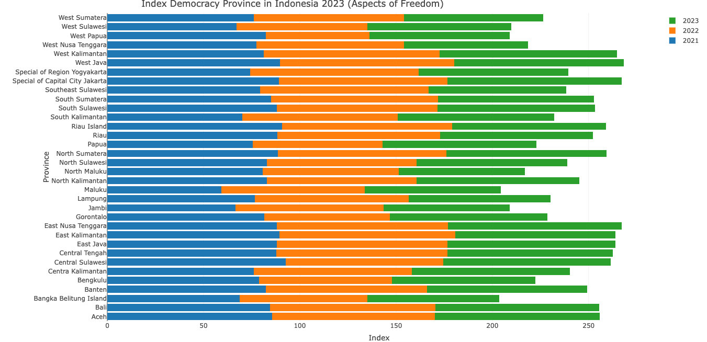
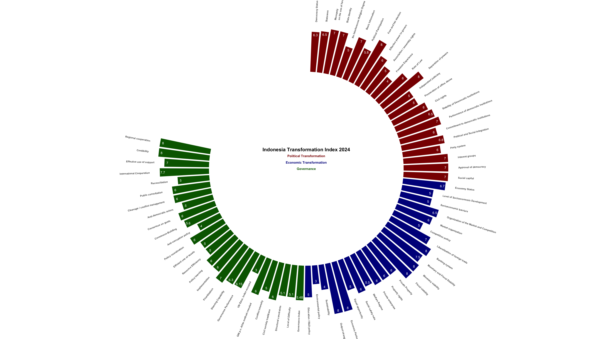

# INDONESIAN DEMOCRACY INDEX 

An R-based guide to exploring, critiquing and visualizing Democracy data in Indonesia, through a collection of publicly available data sources. The democracy data results have been collected from [the Central Bureau of Statistics of Indonesia](https://www.bps.go.id/id/statistics-table?subject=528/)Various functions of the appropriate R packages, I use to statisticize Indonesian democracy from 2009 to 2024.
Hopefully it will be a useful open-source & transparent guide to investigate the past and future state of Indonesian democracy. All work presented here can be reproduced in its entirety.

## [Indonesian Democracy Index (IDI) by Province 2009 - 2011](https://www.bps.go.id/id/statistics-table/2/NTk4IzI=/indeks-demokrasi-indonesia--idi--menurut-provinsi.html)

### Read Data Base
```r
library(knitr)

markdown_table <-kable(idi2009-2011, format = "markdown")
cat(markdown_table)
print(markdown_table)

```
|Province                     |  2009|  2010|  2011|
|:----------------------------|-----:|-----:|-----:|
|Aceh                         | 66.29| 65.36| 55.54|
|North Sumatera               | 60.20| 63.45| 66.15|
|West Sumatera                | 60.29| 63.04| 65.02|
|Riau                         | 75.85| 71.45| 70.65|
|Jambi                        | 71.00| 65.88| 70.46|
|South Sumatera               | 72.52| 73.65| 67.92|
|Bengkulu                     | 64.76| 70.78| 71.36|
|Lampung                      | 67.47| 67.80| 74.08|
|Bangka Belitung Island       | 67.01| 65.94| 67.13|
|Riau Island                  | 73.61| 62.89| 70.78|
|Jakarta                      | 73.91| 77.44| 77.81|
|West Java                    | 71.07| 59.41| 66.18|
|Central Java                 | 66.45| 63.42| 65.59|
|Special Region of Yogyakarta | 67.55| 74.33| 71.67|
|East Java                    | 62.49| 55.12| 55.98|
|Banten                       | 67.98| 60.60| 67.37|
|Bali                         | 70.35| 72.44| 74.20|
|West Nusa Tenggara           | 58.12| 58.13| 54.49|
|East Nusa Tenggara           | 71.64| 72.05| 72.34|
|West Kalimantan              | 72.38| 69.32| 74.86|
|Central Kalimantan           | 77.63| 71.10| 76.28|
|South Kalimantan             | 66.63| 70.94| 66.47|
|East Kalimantan              | 72.31| 73.04| 66.37|
|North Kalimantan             |  0.00|  0.00|  0.00|
|North Sulawesi               | 70.94| 65.94| 71.19|
|Central Sulawesi             | 66.02| 66.63| 64.00|
|South Sulawesi               | 61.48| 56.67| 65.31|
|Southeast Sulawesi           | 64.29| 54.79| 57.56|
|Gorontalo                    | 73.50| 64.97| 62.77|
|West Sulawesi                | 67.99| 68.82| 66.36|
|Maluku                       | 69.07| 69.51| 68.38|
|North Maluku                 | 67.21| 59.92| 59.17|
|West Papua                   | 63.06| 67.75| 61.78|
|Papua                        | 63.80| 60.26| 59.05|

### Create Visualization Indonesian Democracy Index 2009 - 2011  
```r
library(ggplot2)
library(tidyr)

ggplot(idi2009_2011_long, aes(x = reorder(Province, -Index), y = Index, fill = Year)) +
  geom_bar(stat = "identity", position = position_dodge(width = 0.7)) +
  coord_flip() +
  labs(title = "Indonesia Democracy Index 2009-2011",
       subtitle = "Source: Central Statistica Agency",
       x = "Province",
       y = "Index",
       fill = "Year") +
  theme_minimal()

````


### Intrepetation Data about Indonesian Democracy 2009 - 2011

From the visualization results displayed, we can read the development of the level of democracy in each province in Indonesia during 2009 to 2011. If interpreted, the Papua Province Red Bar (2009) is longer than the green bar (2010) and blue (2011). This means that the Papua democracy index decreased from 2009 to 2011. In Aceh Province, the red bar (2009) and blue (2011) are slightly longer, indicating a slight increase in democracy in 2010, but then decreased in 2011.

## [New Methods: Indonesian Democracy Index (IDI) by Province 2021 - 2023 by Aspect of Freedom](https://www.bps.go.id/id/statistics-table/2/MjE2MCMy/-metode-baru--aspek-indeks-demokrasi-indonesia--idi--menurut-provinsi.html)

### Read Data Base

```r
library(knitr)

markdonw_table1 <- kable(idi2021_idi2023)
cat(markdown_table1)

```
|Province                        | X2023| X2022| X2021|
|:-------------------------------|-----:|-----:|-----:|
|Aceh                            | 85.71| 84.66| 85.50|
|North Sumatera                  | 83.12| 87.66| 88.51|
|West Sumatera                   | 72.15| 78.01| 76.19|
|Riau                            | 79.39| 84.46| 88.40|
|Jambi                           | 65.28| 77.13| 66.50|
|South Sumatera                  | 80.94| 86.78| 85.08|
|Bengkulu                        | 74.62| 68.95| 78.81|
|Lampung                         | 73.79| 79.90| 76.64|
|Bangka Belitung Island          | 68.34| 66.36| 68.80|
|Riau Island                     | 79.72| 88.34| 90.91|
|Special of Capital City Jakarta | 90.66| 87.39| 89.27|
|West Java                       | 87.97| 90.61| 89.71|
|Central Tengah                  | 85.84| 88.83| 87.90|
|Special of Region Yogyakarta    | 77.76| 87.35| 74.31|
|East Java                       | 87.29| 88.48| 88.11|
|Banten                          | 83.11| 83.80| 82.26|
|Bali                            | 85.23| 85.78| 84.62|
|West Nusa Tenggara              | 64.49| 76.75| 77.41|
|East Nusa Tenggara              | 90.05| 89.06| 87.99|
|West Kalimantan                 | 92.16| 91.35| 81.15|
|Centra Kalimantan               | 82.01| 82.05| 76.09|
|South Kalimantan                | 81.40| 80.70| 70.13|
|East Kalimantan                 | 83.00| 91.40| 89.46|
|North Kalimantan                | 84.59| 77.93| 82.78|
|North Sulawesi                  | 78.15| 77.76| 82.92|
|Central Sulawesi                | 87.11| 81.69| 92.76|
|South Sulawesi                  | 81.70| 83.39| 88.18|
|Southeast Sulawesi              | 71.72| 87.49| 79.28|
|Gorontalo                       | 81.68| 65.31| 81.57|
|West Sulawesi                   | 74.87| 67.78| 67.24|
|Maluku                          | 70.55| 74.49| 59.36|
|North Maluku                    | 65.58| 70.84| 80.61|
|West Papua                      | 72.89| 53.64| 82.47|
|Papua                           | 79.98| 67.23| 75.64|

### Create Visualization Indonesian Democracy by Aspect of Freedom Index 2021 - 2023 

```r
library(plotly)

fig <-plot_ly(idi2021_2023, x = ~X2021, y = ~Province, type = 'bar',
              name = '2021', orientation = 'h') %>%
  add_trace(x = ~X2022, name = '2022', orientation = 'h') %>%
  add_trace(x = ~X2023, name = '2023', orientation ='h') %>%
  layout(yaxis = list(title = 'Province'), xaxis = list(title = 'Index'),
         barmode = 'stack',
         title = list(text = "Index of Democracy in Indonesia 2021-2023",
                      x = 0.2,
                      pad =list(t = 5, b = 15)
                      ),
         margin = list(t = 25)
         )
fig

```
 
### Intrepertation Indonesian Democracy by Aspect of Freedom Index 2021-2023

The graph you produced shows the Indonesian Democracy Index (IDI) for each province from 2021 to 2023. This data comes from the Indonesian Democracy Index (IDI) and the Central Statistics Agency (BPS). West Sulawesi; This province experienced an increase in its IDI score from 2021 to 2023, with the green bar being longer than the orange and blue bars.West Papua; There was significant fluctuation with the green bar (2023) being longer than the blue bar (2021), but there was a decline in 2022.
This graph helps provide an overview of how the level of democracy in various Indonesian provinces has changed over the past three years. This can be the basis for further analysis, for example to see what factors influenced the increase or decrease in the IDI score in a particular province.

## [New Methods: Indonesian Democracy Index (IDI) by Province 2023 by Aspect of Equality](https://www.bps.go.id/id/statistics-table/2/MjE2MCMy/-metode-baru--aspek-indeks-demokrasi-indonesia--idi--menurut-provinsi.html)

### Read Data Base

```r
library(knitr)

markdown_table2 <-kable(aspectofequality, format = "markdown")
cat(markdown_table2)
print(markdown_table2)

```
| Province|Label                           | Index|
|--------:|:-------------------------------|-----:|
|        1|Papua                           | 60.10|
|        2|West Papua                      | 72.52|
|        3|Aceh                            | 74.47|
|        4|Central Sulawesi                | 74.78|
|        5|North Maluku                    | 74.84|
|        6|Nusa Tenggara East              | 75.66|
|        7|Jambi                           | 76.91|
|        8|Maluku                          | 77.60|
|        9|Central Kalimantan              | 77.66|
|       10|North Sulawesi                  | 78.09|
|       11|West Kalimantan                 | 78.55|
|       12|Riau Island                     | 78.82|
|       13|Bangka Belitung Island          | 78.98|
|       14|Nusa Tenggara West              | 79.26|
|       15|Bengkulu                        | 79.27|
|       16|South Sulawesi                  | 79.52|
|       17|Riau                            | 80.13|
|       18|Central Java                    | 80.24|
|       19|Lampung                         | 80.48|
|       20|Banten                          | 80.59|
|       21|East Kalimantan                 | 81.08|
|       22|North Kalimantan                | 81.24|
|       23|West Sumatera                   | 81.48|
|       24|North Sumatera                  | 81.49|
|       25|West Sulawesi                   | 81.68|
|       26|South Sumatera                  | 82.14|
|       27|South Kalimantan                | 82.60|
|       28|East Jawa                       | 83.24|
|       29|Gorontalo                       | 83.32|
|       30|West Java                       | 83.63|
|       31|Bali                            | 85.75|
|       32|Special of Capital City Jakarta | 86.51|
|       33|Southeast Sulawesi              | 87.06|
|       34|Special of Region Yogyakarta    | 89.21|

### Create Visualization (Geom Text) Indonesian Democracy Index Aspect of Equality 2023

```r
library(ggplot2)
library(ggrepel)

ggplot(aspectofequality, aes(x = Province, y = Index)) + 
  geom_point(color = "white", size = 1) +
  geom_text_repel(aes(label = Label),  
                  color = "black", 
                  size = 3.5,
                  max.overlaps = 30) + 
  geom_smooth(method = "lm", se = FALSE, color = "red") +
  labs(title = "Index Democracy Province in Indonesia 2023 (Aspect of Equality)",
       subtitle = "Source: Indonesian Democracy Index (IDI) and Central Statistics Agency",
       x = "Province",
       y = "Index") + 
  ylim(min(aspectofequality$Index) - 10, max(aspectofequality$Index) + 10) +
  theme(plot.title = element_text(face="bold")) +
  theme_bw()
```


### Intrepretation Indonesian Democracy Index in Aspect of Equality 2023

The image you uploaded shows the 2023 Democracy Index in Indonesia in terms of equality. with the horizontal (X) axis showing the provinces and the vertical (Y) axis showing the index score for each province.
Each point on the graph represents the index value for a province, and the provinces are labeled on the graph. For example, Papua has an index score below 60 (the lowest value in the graph), while the Special Region of Yogyakarta is close to 100 (the highest value in the graph).
The red line shown is a regression or trend line, which shows how the general relationship between provinces and the democracy index in terms of equality. This line tends to rise, indicating that most provinces have higher democracy equality index scores.
Papua has the lowest index score, indicating challenges in terms of democracy equality in the province. The Special Region of Yogyakarta, Southeast Sulawesi, and the Special Region of Capital City Jakarta have the highest index scores, indicating better levels of democracy equality. Overall, the graph shows that there is variation in the equality index across provinces in Indonesia, but most provinces tend to have index scores in the range of 70 to 90.


## [New Methods: Indonesian Democracy Index (IDI) by Province 2009-2023](https://www.bps.go.id/id/statistics-table?subject=528)
I immediately tried to make a graph of the Indonesian democracy index from 2009 to 2023 using data from the Central Statistics Agency and the Indonesian Democracy Index.

### Read Data Base
```r
library(readxl)
library(knitr)

markdown_table3 <-kable(idi2009_2023, format = "markdown")
cat(markdown_table3)
print(markdown_table3)

```
| Years| Index|
|-----:|-----:|
|  2009| 67.30|
|  2010| 63.17|
|  2011| 65.48|
|  2012| 62.63|
|  2013| 63.72|
|  2014| 73.04|
|  2015| 72.82|
|  2016| 70.09|
|  2017| 72.11|
|  2018| 72.39|
|  2019| 74.92|
|  2020| 73.66|
|  2021| 78.12|
|  2022| 80.41|
|  2023| 79.51|

### Create Visualization Indonesian Index Democracy (IDI) 2009-2023
```r
library(ggplot2)
library(dplyr)

idi2009_20223 <-idi2009_2023 %>%
  mutate(Index = as.numeric(Index)) #conversion index to be come numeric

idi2009_2023 %>%
  tail(15) %>%
  ggplot(aes(x = Years, y = Index, group = 1)) +
  geom_line(aes(x = Years, y = Index), color = "black", size = 0.1) +
  geom_point(shape = 20, color = "black", size = 3) +
  geom_text(aes(label = round(Index, 2)),
            vjust = -1, hjust = 0.5, size = 3)+
  theme_test() +
  labs(title = "Indonesia Democracy Index 2009 - 2023",
       subtitle = "Source: Central Statistica Agency & IDI", 
       y = "Index",
       x = "Years") +
  scale_x_continuous(breaks = seq(2000, 2023, by = 1))

```


### Critical Indonesian Democracy Index 2009-2023
Indonesia's democracy index has increased drastically and remained stable from 2017 to 2020, reaching its highest peak of 80.41. After the highest peak, there was a decline in 2023, although it was still above 79, which indicates a problem in Indonesian democracy. The decline in the period from 2022 to 2023 is a signal that Indonesian democracy is not yet fully stable and is still vulnerable to political and social challenges.

## [New Method: Indicators Indonesian Democracy Index by Province 2021-2023](https://www.bps.go.id/id/statistics-table/2/MjE2MyMy/-metode-baru--indikator-indeks-demokrasi-indonesia--idi--tingkat-provinsi.html)

Based on the source of the Indonesian Democracy Index Province 2009 - 2023, Indonesian Democracy in 2023 experienced a decline from 2022 which obtained a value of 80.41. The following is a graphic analysis with the Indonesian Democracy Index Indicator on a Provincial Scale.

### Read Data Base 
```r
library(readxl)
indicatorindexdemocarcyprovince21.23 <-read_xlsx("/Users/mymac/Desktop/Data Github/indicatorindexdemocarcyprovince21-23.xlsx", sheet = "Sheet1") # import data
View(indicatorindexdemocarcyprovince21.23)


library(tidyr)
library(dplyr) make format long data
indicatorindexdemocarcyprovince21.23 <-indicatorindexdemocarcyprovince21_23 %>%
  pivot_longer(cols = c(`2021`, `2022`, `2023`),
               names_to = "Year",
               values_to = "Value")

library(knitr)
markdownindicatoridi21.23 <-kable(indicatorindexdemocarcyprovince21.23, format = "markdown")
cat(markdownindicatoridi21.23)
print(markdownindicatoridi21.23) #view result data markdown

```
|Democracy Indicators                                                                  |Year | Value|
|:-------------------------------------------------------------------------------------|:----|-----:|
|Freedom Between Governments                                                           |2021 | 84.00|
|Freedom Between Governments                                                           |2022 | 80.63|
|Freedom Between Governments                                                           |2023 | 84.87|
|Freedom Between Peoples                                                               |2021 | 76.28|
|Freedom Between Peoples                                                               |2022 | 74.10|
|Freedom Between Peoples                                                               |2023 | 74.90|
|Freedom of Belief                                                                     |2021 | 88.41|
|Freedom of Belief                                                                     |2022 | 86.15|
|Freedom of Belief                                                                     |2023 | 82.94|
|Freedom to Make Policies                                                              |2021 | 84.01|
|Freedom to Make Policies                                                              |2022 | 83.69|
|Freedom to Make Policies                                                              |2023 | 82.88|
|Guaranteed Right to Vote & be Election in Election                                    |2021 | 82.00|
|Guaranteed Right to Vote & be Election in Election                                    |2022 | 82.00|
|Guaranteed Right to Vote & be Election in Election                                    |2023 | 82.00|
|Fullfilment of Workers Right                                                          |2021 | 70.18|
|Fullfilment of Workers Right                                                          |2022 | 73.98|
|Fullfilment of Workers Right                                                          |2023 | 69.08|
|Freedom of Pers                                                                       |2021 | 77.71|
|Freedom of Pers                                                                       |2022 | 78.71|
|Freedom of Pers                                                                       |2023 | 75.69|
|Gender Equality                                                                       |2021 | 91.62|
|Gender Equality                                                                       |2022 | 92.36|
|Gender Equality                                                                       |2023 | 92.50|
|Public participation in influencing public policy through representative institutions |2021 | 77.38|
|Public participation in influencing public policy through representative institutions |2022 | 91.34|
|Public participation in influencing public policy through representative institutions |2023 | 86.22|
|Anti-monopoly of economic resources                                                   |2021 | 63.51|
|Anti-monopoly of economic resources                                                   |2022 | 65.31|
|Anti-monopoly of economic resources                                                   |2023 | 65.15|
|Poor people's access to social protection and security                                |2021 | 76.60|
|Poor people's access to social protection and security                                |2022 | 73.52|
|Poor people's access to social protection and security                                |2023 | 76.61|
|Equality Oportunities Jobs Region                                                     |2021 | 94.51|
|Equality Oportunities Jobs Region                                                     |2022 | 95.03|
|Equality Oportunities Jobs Region                                                     |2023 | 95.39|
|Society Access to Public Information                                                  |2021 | 71.90|
|Society Access to Public Information                                                  |2022 | 76.85|
|Society Access to Public Information                                                  |2023 | 77.75|
|Equality in Basic Policy                                                              |2021 | 72.66|
|Equality in Basic Policy                                                              |2022 | 73.21|
|Equality in Basic Policy                                                              |2023 | 73.46|
|Peformance of Legislation                                                             |2021 | 54.35|
|Peformance of Legislation                                                             |2022 | 54.36|
|Peformance of Legislation                                                             |2023 | 53.92|
|Performance of Yudication                                                             |2021 | 87.41|
|Performance of Yudication                                                             |2022 | 86.82|
|Performance of Yudication                                                             |2023 | 86.51|
|Election of Netrality                                                                 |2021 | 64.36|
|Election of Netrality                                                                 |2022 | 64.36|
|Election of Netrality                                                                 |2023 | 61.44|
|Decision of the State Administrative Court regarding government official policies     |2021 | 68.69|
|Decision of the State Administrative Court regarding government official policies     |2022 | 61.50|
|Decision of the State Administrative Court regarding government official policies     |2023 | 69.09|
|Environmental & Living Space Guarantee                                                |2021 | 72.21|
|Environmental & Living Space Guarantee                                                |2022 | 73.07|
|Environmental & Living Space Guarantee                                                |2023 | 73.36|
|Government Budget Transparency                                                        |2021 | 68.91|
|Government Budget Transparency                                                        |2022 | 83.61|
|Government Budget Transparency                                                        |2023 | 94.54|
|Performance Birocration and Public Services                                           |2021 | 78.02|
|Performance Birocration and Public Services                                           |2022 | 81.36|
|Performance Birocration and Public Services                                           |2023 | 72.85|
|Education Politics to Political Party                                                 |2021 | 54.27|
|Education Politics to Political Party                                                 |2022 | 73.45|
|Education Politics to Political Party                                                 |2023 | 54.02|

### Indicators Indonesian Democracy Index by Province 2021-2023
```r
library(ggplot2)

ggplot(indicatorindexdemocarcyprovince21.23, aes(x = Year, y = `Democracy Indicators`,
                                                 fill = Value)) +
  geom_tile(colour = "white", linewidth = 1)+
  scale_fill_gradient(low = "skyblue", high = "darkblue") +
  geom_text(aes(label = round(Value, 2)), color = 'black', size = 3.5) +
  theme_minimal()+
  labs(title = "Indicators Indonesian Democracy Index Source Province 2021-2023",
       subtitle ="Source: Central Statistica Agency & IDI") +
  theme(plot.title = element_text(face = "bold"))

```


### How to Read Changes in the Indonesian Democracy Index Indicator from 2021-2023
Stability: If an indicator shows almost the same color from 2021 to 2023, this indicates that the index value of the indicator has been relatively stable over the past three years. Increase: An indicator that shows a shift from a lighter color (lower value) to a darker color (higher value) from 2021 to 2023 indicates an increase in the index. Decrease Conversely, if the shift occurs from a dark color to a light color, this indicates a decrease in the democracy index on the indicator.

## [Transformation Towards Democrarcy Indonesia Source From the Bertelsmann Stiftung’s Transformation Index (BTI) 2024](https://bti-project.org/fileadmin/api/content/en/downloads/reports/country_report_2024_IDN.pdf)

This explain scores data to the translate in ranking numeric scala number 1 (Lowest) to scale number 10 (Highest).

## Data Frame 

```r

   library(ggplot2)
   library(dplyr)
   library(tidyr)
   
   # Create a data frame from the provided data
   data <- data.frame(
     Category = c('Democracy Status', 'Stateness', 'Monopoly\n on the use of force', 'State Identity', 'No Interferences Religion Dogma', 'Basic Information',
                  'Political Participation', 'Free and fair election', 'Effective power to govern', 'Association / assembly rights', 'Freedom Experience',
                  'Rule of Law', 'Separation of powers', 'Independent judiciary', 'Prosecution of office abuse', 'Civil rights',
                  'Stability of Democratic Institutions', 'Performance of democratic institutions', 'Commitment to democratic institutions',
                  'Political and Social Integration', 'Party system', 'Interest groups', 'Approval of democracy', 'Social capital',
                  'Economy Status', 'Level of Socioeconomic Development', 'Socioeconomic barriers',
                  'Organization of the Market and Competition', 'Market organization', 'Competition policy', 'Liberalization of foreign trade',
                  'Banking system', 'Monetary and Fiscal Stability', 'Monetary stability', 'Fiscal stability',
                  'Private Property', 'Property rights', 'Private enterprise',
                  'Welfare Regime', 'Social safety nets', 'Equal opportunity',
                  'Economic Performance', 'Output strength', 'Sustainability', 'Environmental policy', 'Education / R&D policy',
                  'Governance Index', 'Level of Difficulty', 'Structural constraints', 'Civil society traditions', 
                  'Conflict intensity', 'GNI p.c. Atlas method rescaled','UN Educ. Index rescaled',
                  'Governance Performance','Steering Capability','Prioritization','Implementation','Policy learning',
                  'Resource Efficiency','Efficient use of assets','Policy coordination','Anti-corruption policy',
                  'Consensus-Building','Consensus on goals','Anti-democratic actors','Cleavage / conflict management','Public consultation','Reconciliation',
                  'International Cooperation','Effective use of support','Credibility','Regional cooperation'),
     Score = c(6.3, 6.5, 7, 7, 5, 7, 5.8, 8, 6, 5, 4, 6, 8, 5, 5, 6, 6.5, 7, 6, 6.8, 6, 7, 7, 7,
               6.7, 5, 5, 6.5, 6, 5, 7, 8, 7.5, 8, 8, 6, 6, 6,
               5.5, 6, 5,
               8, 8, 4, 3, 5,
               5.48, 5.1, 5.1, 6,
               5, 6 ,3,
               6.15 ,6.3 ,7 ,6 ,6,
               5 ,5 ,6 ,4,
               5.6 ,6 ,5 ,6 ,6 ,5,
               7.7 ,7 ,8 ,8)
   )

print(data)

                                     Category Score
1                            Democracy Status  6.30
2                                   Stateness  6.50
3              Monopoly\n on the use of force  7.00
4                              State Identity  7.00
5             No Interferences Religion Dogma  5.00
6                           Basic Information  7.00
7                     Political Participation  5.80
8                      Free and fair election  8.00
9                   Effective power to govern  6.00
10              Association / assembly rights  5.00
11                         Freedom Experience  4.00
12                                Rule of Law  6.00
13                       Separation of powers  8.00
14                      Independent judiciary  5.00
15                Prosecution of office abuse  5.00
16                               Civil rights  6.00
17       Stability of Democratic Institutions  6.50
18     Performance of democratic institutions  7.00
19      Commitment to democratic institutions  6.00
20           Political and Social Integration  6.80
21                               Party system  6.00
22                            Interest groups  7.00
23                      Approval of democracy  7.00
24                             Social capital  7.00
25                             Economy Status  6.70
26         Level of Socioeconomic Development  5.00
27                     Socioeconomic barriers  5.00
28 Organization of the Market and Competition  6.50
29                        Market organization  6.00
30                         Competition policy  5.00
31            Liberalization of foreign trade  7.00
32                             Banking system  8.00
33              Monetary and Fiscal Stability  7.50
34                         Monetary stability  8.00
35                           Fiscal stability  8.00
36                           Private Property  6.00
37                            Property rights  6.00
38                         Private enterprise  6.00
39                             Welfare Regime  5.50
40                         Social safety nets  6.00
41                          Equal opportunity  5.00
42                       Economic Performance  8.00
43                            Output strength  8.00
44                             Sustainability  4.00
45                       Environmental policy  3.00
46                     Education / R&D policy  5.00
47                           Governance Index  5.48
48                        Level of Difficulty  5.10
49                     Structural constraints  5.10
50                   Civil society traditions  6.00
51                         Conflict intensity  5.00
52             GNI p.c. Atlas method rescaled  6.00
53                    UN Educ. Index rescaled  3.00
54                     Governance Performance  6.15
55                        Steering Capability  6.30
56                             Prioritization  7.00
57                             Implementation  6.00
58                            Policy learning  6.00
59                        Resource Efficiency  5.00
60                    Efficient use of assets  5.00
61                        Policy coordination  6.00
62                     Anti-corruption policy  4.00
63                         Consensus-Building  5.60
64                         Consensus on goals  6.00
65                     Anti-democratic actors  5.00
66             Cleavage / conflict management  6.00
67                        Public consultation  6.00
68                             Reconciliation  5.00
69                  International Cooperation  7.70
70                   Effective use of support  7.00
71                                Credibility  8.00
72                       Regional cooperation  8.00

```
###  Assign colors based on Category
```r

   data <- data %>%
     mutate(Color = case_when(
       Category %in% c('Democracy Status', 'Stateness', 'Monopoly on the use of force', 'State Identity', 'No Interferences Religion Dogma', 'Basic Information',
                       'Political Participation', 'Free and fair election', 'Effective power to govern', 'Association / assembly rights', 'Freedom Experience',
                       'Rule of Law', 'Separation of powers', 'Independent judiciary', 'Prosecution of office abuse', 'Civil rights',
                       'Stability of Democratic Institutions', 'Performance of democratic institutions', 'Commitment to democratic institutions',
                       'Political and Social Integration', 'Party system', 'Interest groups', 'Approval of democracy', 'Social capital') ~ 'darkred',
       Category %in% c('Economy Status', 'Level of Socioeconomic Development', 'Socioeconomic barriers',
                       'Organization of the Market and Competition', 'Market organization', 'Competition policy', 'Liberalization of foreign trade',
                       'Banking system', 'Monetary and Fiscal Stability', 'Monetary stability', 'Fiscal stability',
                       'Private Property', 'Property rights', 'Private enterprise',
                       'Welfare Regime', 'Social safety nets', 'Equal opportunity',
                       'Economic Performance', 'Output strength', 'Sustainability', 'Environmental policy', 'Education / R&D policy') ~ 'darkblue',
       TRUE ~ 'darkgreen'
     )) %>%
     mutate(id = row_number()) %>%
     arrange(id)
   
   # Add more empty bars for spacing for model visual circular
   empty_bar <- 20
   to_add <- matrix(NA, empty_bar, ncol(data))
   colnames(to_add) <- colnames(data)
   data <- rbind(data, to_add)
   data$id <- seq(1, nrow(data))

print(data)

Category Score     Color id
1                            Democracy Status  6.30   darkred  1
2                                   Stateness  6.50   darkred  2
3              Monopoly\n on the use of force  7.00   darkred  3
4                              State Identity  7.00   darkred  4
5             No Interferences Religion Dogma  5.00   darkred  5
6                           Basic Information  7.00   darkred  6
7                     Political Participation  5.80   darkred  7
8                      Free and fair election  8.00   darkred  8
9                   Effective power to govern  6.00   darkred  9
10              Association / assembly rights  5.00   darkred 10
11                         Freedom Experience  4.00   darkred 11
12                                Rule of Law  6.00   darkred 12
13                       Separation of powers  8.00   darkred 13
14                      Independent judiciary  5.00   darkred 14
15                Prosecution of office abuse  5.00   darkred 15
16                               Civil rights  6.00   darkred 16
17       Stability of Democratic Institutions  6.50   darkred 17
18     Performance of democratic institutions  7.00   darkred 18
19      Commitment to democratic institutions  6.00   darkred 19
20           Political and Social Integration  6.80   darkred 20
21                               Party system  6.00   darkred 21
22                            Interest groups  7.00   darkred 22
23                      Approval of democracy  7.00   darkred 23
24                             Social capital  7.00   darkred 24
25                             Economy Status  6.70  darkblue 25
26         Level of Socioeconomic Development  5.00  darkblue 26
27                     Socioeconomic barriers  5.00  darkblue 27
28 Organization of the Market and Competition  6.50  darkblue 28
29                        Market organization  6.00  darkblue 29
30                         Competition policy  5.00  darkblue 30
31            Liberalization of foreign trade  7.00  darkblue 31
32                             Banking system  8.00  darkblue 32
33              Monetary and Fiscal Stability  7.50  darkblue 33
34                         Monetary stability  8.00  darkblue 34
35                           Fiscal stability  8.00  darkblue 35
36                           Private Property  6.00  darkblue 36
37                            Property rights  6.00  darkblue 37
38                         Private enterprise  6.00  darkblue 38
39                             Welfare Regime  5.50  darkblue 39
40                         Social safety nets  6.00  darkblue 40
41                          Equal opportunity  5.00  darkblue 41
42                       Economic Performance  8.00  darkblue 42
43                            Output strength  8.00  darkblue 43
44                             Sustainability  4.00  darkblue 44
45                       Environmental policy  3.00  darkblue 45
46                     Education / R&D policy  5.00  darkblue 46
47                           Governance Index  5.48 darkgreen 47
48                        Level of Difficulty  5.10 darkgreen 48
49                     Structural constraints  5.10 darkgreen 49
50                   Civil society traditions  6.00 darkgreen 50
51                         Conflict intensity  5.00 darkgreen 51
52             GNI p.c. Atlas method rescaled  6.00 darkgreen 52
53                    UN Educ. Index rescaled  3.00 darkgreen 53
54                     Governance Performance  6.15 darkgreen 54
55                        Steering Capability  6.30 darkgreen 55
56                             Prioritization  7.00 darkgreen 56
57                             Implementation  6.00 darkgreen 57
58                            Policy learning  6.00 darkgreen 58
59                        Resource Efficiency  5.00 darkgreen 59
60                    Efficient use of assets  5.00 darkgreen 60
61                        Policy coordination  6.00 darkgreen 61
62                     Anti-corruption policy  4.00 darkgreen 62
63                         Consensus-Building  5.60 darkgreen 63
64                         Consensus on goals  6.00 darkgreen 64
65                     Anti-democratic actors  5.00 darkgreen 65
66             Cleavage / conflict management  6.00 darkgreen 66
67                        Public consultation  6.00 darkgreen 67
68                             Reconciliation  5.00 darkgreen 68
69                  International Cooperation  7.70 darkgreen 69
70                   Effective use of support  7.00 darkgreen 70
71                                Credibility  8.00 darkgreen 71
72                       Regional cooperation  8.00 darkgreen 72
73                                       <NA>    NA      <NA> 73
74                                       <NA>    NA      <NA> 74
75                                       <NA>    NA      <NA> 75
76                                       <NA>    NA      <NA> 76
77                                       <NA>    NA      <NA> 77
78                                       <NA>    NA      <NA> 78
79                                       <NA>    NA      <NA> 79
80                                       <NA>    NA      <NA> 80
81                                       <NA>    NA      <NA> 81
82                                       <NA>    NA      <NA> 82
83                                       <NA>    NA      <NA> 83
84                                       <NA>    NA      <NA> 84
85                                       <NA>    NA      <NA> 85
86                                       <NA>    NA      <NA> 86
87                                       <NA>    NA      <NA> 87
88                                       <NA>    NA      <NA> 88
89                                       <NA>    NA      <NA> 89
90                                       <NA>    NA      <NA> 90
91                                       <NA>    NA      <NA> 91
92                                       <NA>    NA      <NA> 92
```
## Indonesia Transformation Index 2024

```r
library(ggplot2)

 # Add more empty bars for spacing
  empty_bar <- 20
   to_add <- matrix(NA, empty_bar, ncol(data))
   colnames(to_add) <- colnames(data)
   data <- rbind(data, to_add)
   data$id <- seq(1, nrow(data))
   
   # Create the plot
   label_data <- data
   number_of_bar <- nrow(data)
   angle <- 90 - 360 * (label_data$id - 0.5) / number_of_bar
   label_data$hjust <- ifelse(angle < -90, 1, 0)
   label_data$angle <- ifelse(angle < -90, angle + 180, angle)
   
   p <- ggplot(data, aes(x = as.factor(id), y = Score, fill = Color)) +      
     geom_bar(stat = "identity", color = "white") +
     scale_fill_identity() +
     ylim(-15, 10) +  # Adjust to make the circle fuller
     theme_minimal() +
     theme(
       axis.text = element_blank(),
       axis.title = element_blank(),
       panel.grid = element_blank(),
       plot.margin = unit(rep(-2, 4), "cm") 
     ) +
     coord_polar(start = 0) + 
     # Display Category names
     geom_text(data = label_data, aes(x = id, y = Score + 1.5, label = Category, hjust = hjust), color = "black", fontface = "bold", alpha = 0.7, size = 1.5, angle = label_data$angle, inherit.aes = FALSE) +
     # Display Score values
     geom_text(aes(x = as.factor(id), y = Score - 0.5, label = Score), color = "white", size = 2) +
     # Add central legend
 annotate("text", x = 0, y = -12, label = "Indonesia Transformation Index 2024", color = "black", fontface = "bold", size = 3) +
     annotate("text", x = 0, y = -13, label = "Political Transformation", color = "darkred",fontface = "bold", size = 2) +
     annotate("text", x = 0, y = -14, label = "Economic Transformation", color = "darkblue",fontface = "bold", size = 2) +
     annotate("text", x = 0, y = -15, label = "Governance", color = "darkgreen", fontface = "bold", size = 2) 
     
   # show visual graph  
   print(p)
   
```


### Transformation Index Indonesia Source:Bertelsmann Stiftung’s Transformation Index (BTI) 2024
We can distinguish some colors, red by Political Transformation, blue by Economic Transformation and green by Governance. Interpretation per first category, Political Transformation seems to have a high red bar indicating about political stabilization, quality democracy, free society and, protection of human rights by the government.
And than Economic Transformation, this category has aspects such as market competition, policy trade, economic stabilization, and money infrastructure. Low scores have challenges in capital efficiency or economic stabilization.
Lastly about Governance, has aspects of anti-corruption policy, asset utilization, and international relations. High scores indicate effective governance by the government and low corruption. Low scores may indicate Indonesia's challenges in developing effective institutions.
